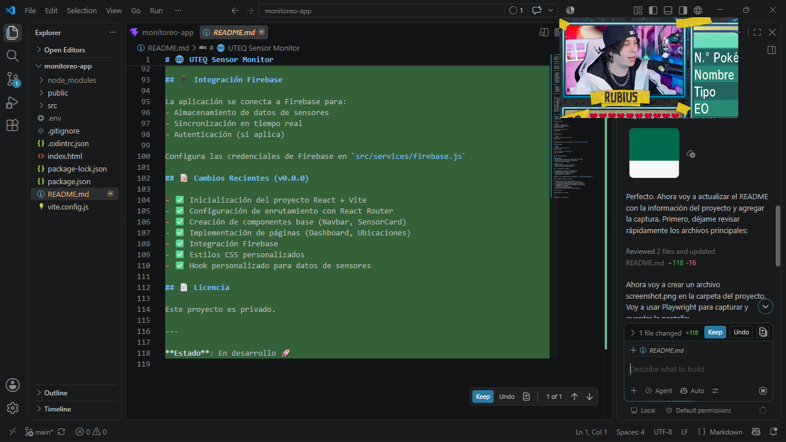

# 🌐 UTEQ Sensor Monitor

Sistema de monitoreo de sensores en tiempo real desarrollado con **React + Vite**. Permite visualizar datos de sensores distribuidos en diferentes ubicaciones geográficas con actualizaciones automáticas desde Firebase.



## 📋 Descripción del Proyecto

**UTEQ Sensor Monitor** es una aplicación web moderna y responsiva que proporciona un dashboard interactivo para monitorear sensores en tiempo real. La aplicación está completamente integrada con Firebase para almacenamiento de datos y sincronización en tiempo real, permitiendo visualizar:

- 🌡️ Temperatura en tiempo real
- 💧 Humedad relativa
- 🧭 Presión atmosférica
- 📊 Historial de mediciones

## ✨ Características Principales

- **Dashboard de Sensores**: Visualiza datos en tiempo real de sensores específicos
- **Tarjetas de Sensor**: Componentes interactivos que muestran métricas clave con iconos
- **Historial de Mediciones**: Tabla completa de datos históricos de sensores
- **Navegación Intuitiva**: Barra de navegación moderna y responsive
- **Página de Ubicaciones**: Interfaz para gestionar y visualizar ubicaciones de sensores
- **Integración Firebase**: Sincronización en tiempo real con Realtime Database
- **Diseño Responsivo**: Totalmente optimizado para dispositivos móviles y desktop
- **Contraste Mejorado**: Colores optimizados para mejor legibilidad
- **Actualizaciones Automáticas**: Los datos se actualizan automáticamente desde Firebase

## 🛠️ Tecnologías Utilizadas

| Tecnología | Versión | Propósito |
|-----------|---------|----------|
| **React** | 19.2.8 | Librería principal de UI |
| **Vite** | 8.2.0 | Bundler y dev server |
| **React Router** | 7.18.2 | Enrutamiento de la aplicación |
| **Firebase** | 12.17.1 | Base de datos y autenticación |
| **CSS3** | - | Estilos personalizados |

## 📁 Estructura del Proyecto

```
src/
├── components/
│   ├── Navbar.jsx           # Barra de navegación principal
│   └── SensorCard.jsx       # Componente para mostrar datos de sensor
├── pages/
│   ├── Dashboard.jsx        # Página principal con datos en tiempo real
│   └── Ubicaciones.jsx      # Página de ubicaciones de sensores
├── hooks/
│   └── useSensorData.js     # Hook personalizado para obtener datos
├── services/
│   └── firebase.js          # Configuración e inicialización de Firebase
├── App.jsx                  # Componente raíz con routing
├── main.jsx                 # Punto de entrada
└── styles.css               # Estilos globales
```

## 🚀 Inicio Rápido

### Requisitos Previos
- **Node.js** 16 o superior
- **npm** o **yarn**
- Cuenta en **Firebase** (para configurar la base de datos)

### Instalación

```bash
# 1. Clonar el repositorio
git clone https://github.com/JordyZamora/monitoreo-app.git
cd monitoreo-app

# 2. Instalar dependencias
npm install

# 3. Configurar variables de Firebase
# Editar src/services/firebase.js con tus credenciales
```

### Desarrollo

```bash
# Iniciar servidor de desarrollo
npm run dev
```

La aplicación estará disponible en `http://localhost:5174/`

El servidor incluye **HMR** (Hot Module Replacement) para actualizaciones en tiempo real mientras desarrollas.

### Producción

```bash
# Compilar para producción
npm run build

# Vista previa de la compilación
npm run preview

# Ejecutar linting
npm run lint
```

## 📊 Funcionalidades Detalladas

### 🎯 Dashboard
- Visualización de datos en tiempo real del sensor seleccionado
- Tres tarjetas principales mostrando:
  - **Temperatura**: En grados Celsius
  - **Humedad**: En porcentaje
  - **Presión Atmosférica**: En hectopascales (hPa)
- Timestamp de última actualización
- Identificador único del sensor
- Tabla de historial de mediciones con scroll horizontal
- Link para navegar a todas las ubicaciones

### 📍 Ubicaciones
- Listado de todas las ubicaciones disponibles
- Información de cada sensor por ubicación
- Interfaz de navegación intuitiva
- Diseño responsive con grid adaptable

## 🔌 Integración Firebase

### Configuración Requerida

1. Crear proyecto en [Firebase Console](https://console.firebase.google.com)
2. Habilitar Realtime Database
3. Copiar credenciales en `src/services/firebase.js`

La aplicación utiliza:
- **Realtime Database** para sincronización de datos
- **Security Rules** para proteger acceso a datos

### Estructura de Datos en Firebase

```json
{
  "sensores": {
    "sensor_1250165337": {
      "nombre": "ZAMORA BARRIGA JORDY NAHIN",
      "ubicacion": "Entrada principal - Sector 38",
      "estado": "En línea"
    }
  },
  "valoresHistoricos": {
    "sensor_1250165337": {
      "timestamp": { "temperatura": 31.47, "humedad": 65.96, "presion": 1009.88 }
    }
  }
}
```

## 📝 Cambios Recientes - v1.0.0

### ✅ Implementaciones Completadas
- ✅ Inicialización del proyecto React + Vite
- ✅ Configuración completa de enrutamiento (React Router v7)
- ✅ Componentes base: Navbar y SensorCard
- ✅ Páginas: Dashboard y Ubicaciones
- ✅ Integración completa con Firebase Realtime Database
- ✅ Estilos CSS personalizados con diseño moderno
- ✅ Hook `useSensorData.js` para gestión de datos
- ✅ **Corrección de contraste**: Colores de texto optimizados a negro oscuro (#000000)
- ✅ **Imagen de pantalla**: Captura actualizada en README

### 🔧 Mejoras Aplicadas
- Mejora de contraste de colores para mejor legibilidad
- Sincronización automática con Firebase
- Diseño responsive en todas las vistas
- Optimización de estilos globales

### 📅 Fecha de Última Actualización
**13 de agosto de 2026** - Actualización completa de documentación e imagen

## 🎨 Paleta de Colores

| Elemento | Color | Hex |
|----------|-------|-----|
| Fondo Principal | Verde oscuro | #006b4f |
| Texto | Negro oscuro | #000000 |
| Fondo Secundario | Verde claro | #f4f8f6 |
| Bordes | Verde muy claro | #dce9e4 |
| Iconos | Variado | 🌡️💧🧭 |

## 📚 Documentación Adicional

### Variables de Entorno
Configura en `src/services/firebase.js`:
```javascript
const firebaseConfig = {
  apiKey: "TU_API_KEY",
  authDomain: "tu-proyecto.firebaseapp.com",
  databaseURL: "https://tu-proyecto.firebaseio.com",
  projectId: "tu-proyecto",
  storageBucket: "tu-proyecto.appspot.com",
  messagingSenderId: "123456789",
  appId: "1:123456789:web:abcdef123456"
};
```

## 🤝 Contribución

Este proyecto es privado y está en desarrollo. Para contribuciones, contactar al propietario.

## 📄 Licencia

Proyecto privado - UTEQ

---

## 📞 Contacto

**Desarrollador**: Jordy Zamora Barriga  
**Email**: jzamorab6@uteq.edu.ec  
**Institución**: UTEQ (Universidad Técnica Estatal de Quevedo)

---

**Estado del Proyecto**: 🚀 En desarrollo activo  
**Última revisión**: 13 de agosto de 2026
